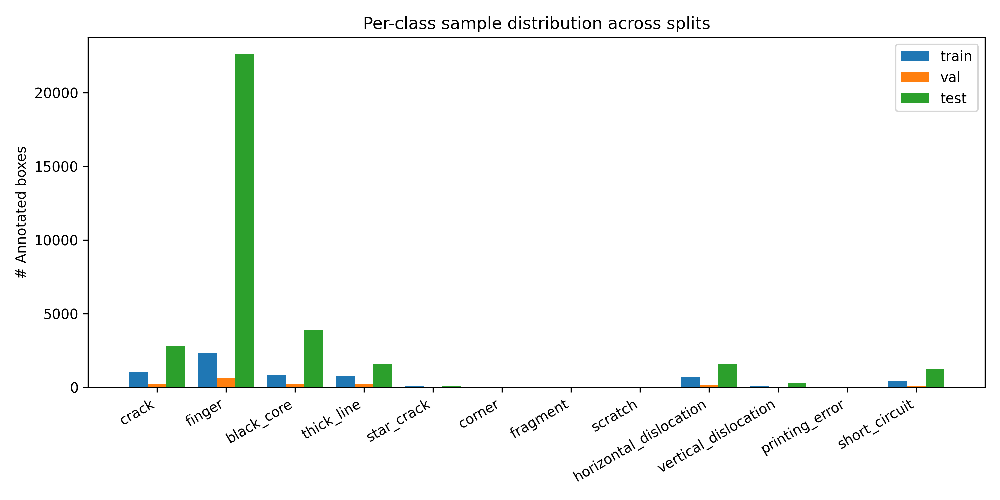
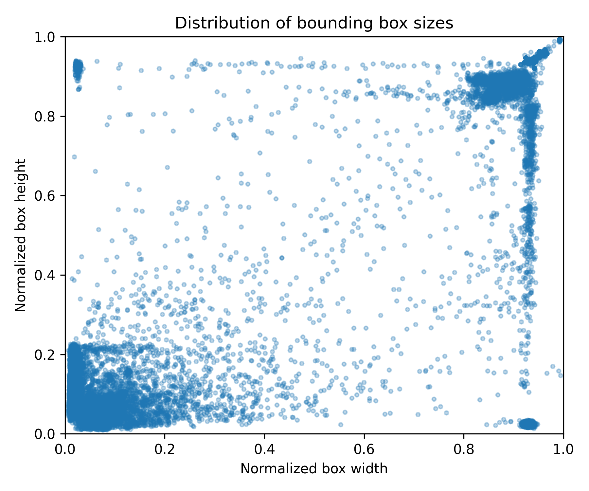

# 第 3 章 数据集与方法

本章首先介绍 PVEL-AD 数据集的组织与统计特性，然后描述本文提出的轻量化光伏缺陷检测网络的整体结构与各模块设计。

## 3.1 数据集

### 3.1.1 PVEL-AD 数据集来源

本文实验采用 PVEL-AD（Photovoltaic EL Anomaly Detection）数据集 [9]，该数据集由河北工业大学与北京航空航天大学于 2021 年联合发布，是当前光伏 EL 缺陷检测领域规模最大、类别最丰富的公开基准。原始数据需向作者团队签订工业数据使用协议获取，作者于 2026 年 1 月公开了 Google Drive 下载链接。本文所使用的数据严格遵循其学术使用协议，仅用于本毕业论文的算法研究。

数据集原始组织结构如下：

```
solar_cell_EL_image/PVELAD/EL2021/
├── trainval/        # 4500 张含缺陷图像 + 对应 VOC 格式 xml 标注
├── test/            # 19150 张含缺陷测试集图像
└── othertypes/
    └── good/        # 11353 张无缺陷正常单元图像（无标注）

test_annotation/
└── test/            # 19150 个测试集 xml 标注（作者于 2024 年公开）
```

数据规模与论文中的描述一致：36543 张近红外图像（jpg, 分辨率主要为 1024×1024）、12 类缺陷、40358 个边界框标注，加上 11353 张无缺陷负样本。

### 3.1.2 数据集组织与划分

为了贴近实际部署场景，本文将无缺陷正样本（good）作为负样本（背景类）纳入训练，使模型在监督信号中显式学习"何为正常"。最终的 train/val/test 划分如下：

| 划分 | 来源 | 含缺陷图像 | 无缺陷负样本 | 标注框总数 |
|------|-----|------------|--------------|------------|
| train | trainval 80% + good 80% | 3 600 | 9 082 | 6 254 |
| val   | trainval 20% + good 20% |   900 | 2 271 | 1 588 |
| test  | 官方 test 集            | 19 150 |     0 | 34 116 |
| **合计** | | **23 650** | **11 353** | **41 958** |

> 表 3.1 PVEL-AD 数据集训练划分

划分原则有三：（1）训练/验证集从 trainval（含缺陷）与 good（无缺陷）中各按 8:2 划分，避免测试集污染训练；（2）测试集严格使用官方 test 集，与文献结果可比；（3）随机划分使用固定种子 `seed=42` 保证可复现。

### 3.1.3 类别分布与挑战分析

PVEL-AD 标准命名的 12 类缺陷在 train+val 集上的分布见图 3.1。基于 6254 个训练集 box（输入 imgsz=640）实测的统计结果显示：

- **长尾分布**：训练+验证集合计 7842 个标注框中，"finger" 类占 2958 个（37.7%），是数据集主导类别；"scratch" 类仅 5 个，最多/最少之比 591×。在测试集上 finger 22638、scratch 3，比例进一步放大到 7546×；全集层面（train+val+test 合 41958 框）finger 25596、scratch 8，比例 3200×。**本文方法设计应基于训练时实际看到的 591× 比例**，而非测试集或全集的统计。
- **尺度分布双峰**：边界框归一化边长（imgsz=640 下）的 10/50/90 分位为 0.038 / 0.063 / 0.890，对应像素 24 / 40 / 570；47% 的框 ≤ 32 像素（COCO small object 区间），其余多为 ≥ 64 像素的中-大目标。**特别地，作为最多发的 finger 类（37% 框），其中位边长 28.9 像素、最小 14.5 像素**，恰处于 P3（stride=8，最小可检约 8 像素）的判别下限——这是本文 P2 分支的真实动机。
- **正负样本均衡**：通过引入 11353 张 good 类负样本，含缺陷与无缺陷图像比例约为 2:1，避免了 train 阶段负样本过少导致的高误检。



> 图 3.1 PVEL-AD 训练集与验证集中各类缺陷的标注框数量分布



> 图 3.2 标注框相对图像尺寸的归一化分布散点图（0–0.05 区间集中分布表明小目标占比高）

### 3.1.4 数据增强策略

ultralytics 训练管线默认提供的增强组合（均以默认强度参数启用）包括：

- **几何变换**：随机水平翻转（p=0.5）、随机仿射变换（scale=0.5, translate=0.1）；
- **颜色扰动**：HSV 色调（h=0.015）/ 饱和度（s=0.7）/ 亮度（v=0.4）；
- **混合增强**：Mosaic 拼接（p=1.0）在最后 10 个 epoch 关闭；
- **图像质量扰动**：低概率 Blur / MedianBlur / ToGray / CLAHE（p=0.01）。

未额外启用 MixUp 与 CopyPaste，原因是预实验显示在长尾光伏数据集上这些增强会引入过多虚假样本组合。

## 3.2 整体网络架构

### 3.2.1 网络架构总览

本文以 YOLOv11n 为基线，在保持检测速度优势的前提下引入两个核心改进：CBAM 注意力增强与 P2 小目标分支。整体网络结构如图 3.3 所示，由骨干网络（Backbone）、颈部网络（Neck）与检测头（Head）三部分组成：


> 图 3.3 本文提出的轻量化光伏缺陷检测网络整体架构

各部分的功能与设计要点如下：

- **骨干网络**：基于 YOLOv11 的 C3k2 + SPPF + C2PSA 结构，在 P3 / P4 / P5 三个特征层级后插入 CBAM 模块，形成层次化注意力增强；
- **颈部网络**：保留 YOLOv11 的 PAN-FPN 双向融合，但在自顶向下路径上向更高分辨率（步长 4，P2 分支）延伸一层；
- **检测头**：采用四尺度（P2/P3/P4/P5）解耦头结构，对应步长 4 / 8 / 16 / 32 的输出，分别对应 160×160、80×80、40×40、20×20 的预测特征图。

### 3.2.2 与基线 YOLOv11n 的对比

| 模块 | YOLOv11n（baseline） | 本文方法 |
|---|---|---|
| 骨干注意力 | 仅 C2PSA（P5 后）| **CBAM × 3**（P3/P4/P5）|
| 检测尺度 | 3 尺度（P3/P4/P5）| **4 尺度**（P2/P3/P4/P5）|
| 检测头数 | 3 头 | **4 头** |
| 最高分辨率检测分支 | 80×80（P3）| **160×160**（P2）|
| 参数量 | 约 2.6M | 约 [待填] M |
| GFLOPs | 6.5 | 约 [待填] |

> 注：参数量与 FLOPs 待 `eval_complexity.py` 实测后填入。

## 3.3 CBAM 注意力增强模块

### 3.3.1 模块结构

CBAM [31] 由通道注意力（Channel Attention）与空间注意力（Spatial Attention）串联组成（图 3.4）：


> 图 3.4 CBAM 注意力模块的双分支结构

**通道注意力分支**：

输入特征 $X \in \mathbb{R}^{C \times H \times W}$ 经全局平均池化与全局最大池化分别获得 $\mathbf{z}_{avg}, \mathbf{z}_{max} \in \mathbb{R}^C$，二者共享同一个 MLP（中间通道 $C/r$，$r=16$）：

$$M_c(X) = \sigma\left(\text{MLP}(\mathbf{z}_{avg}) + \text{MLP}(\mathbf{z}_{max})\right)$$

输出注意力向量 $M_c(X) \in [0,1]^C$，与输入逐通道相乘。

**空间注意力分支**：

通道注意力的输出 $X' = M_c(X) \otimes X$ 沿通道维度做平均池化与最大池化，拼接后通过 7×7 卷积得到空间注意力图：

$$M_s(X') = \sigma\left(f^{7\times 7}\left([\text{ChAvg}(X'); \text{ChMax}(X')]\right)\right)$$

其中 $M_s(X') \in [0,1]^{H \times W}$ 与 $X'$ 逐位置相乘。

最终输出 $X'' = M_s(X') \otimes X'$，CBAM 整体可视为对原始特征做"通道选择 + 空间定位"的两步精炼。

### 3.3.2 在 YOLOv11n 骨干中的注入位置

本文在骨干的 P3、P4、P5 三个层级末端各插入一个 CBAM 模块（具体配置见 `configs/yolo11n_full.yaml`）。三个层级的注意力分别处理不同尺度的特征：

- **P3-CBAM（80×80）**：增强对栅线断裂、隐裂等小尺寸缺陷的判别能力；
- **P4-CBAM（40×40）**：聚焦黑芯、印刷错误等中等尺寸缺陷；
- **P5-CBAM（20×20）**：辅助识别与电池片整体特性相关的缺陷（如短路、对位错位）。

所有 CBAM 的通道压缩比 $r$ 统一取 16，空间注意力卷积核取 7×7，符合原论文推荐配置。

### 3.3.3 与基线 SE / ECA 的差异

YOLOv11 默认在 P5 后插入 C2PSA（基于通道注意力的 PSA 模块），但其作用范围仅限单层级。CBAM 相较 SE/ECA 的优势在于显式建模空间维度的注意力，对"位置敏感"类缺陷（如栅线断裂仅出现在固定栅格位置）尤为有效。3.4 节的消融实验将与 EMA 对比验证 CBAM 的合理性。

## 3.4 P2 小目标检测分支

### 3.4.1 设计动机

通用 YOLO 检测器最浅的 P3 分支步长为 8，在 $640\times640$ 输入下输出 80×80 特征图，单个目标在该分支上的最小可检出尺寸约为 8 像素。基于 6254 个训练集 box 的实测：

- **finger 类是 PVEL-AD 训练集中绝对主导的缺陷类别**（占 37.7% 框，2317 个），其边界框在 imgsz=640 下中位边长 28.9 像素、最小 14.5 像素、p10 仅 24 像素。
- 在 P3 stride=8 输出特征图上，14.5 像素的目标只占据约 1.8 个网格单元，难以提供足够的判别信号。

为此本文新增 **P2 分支**：步长 4，输出 160×160 特征图。P2 分支同时具备两个特性：（1）对 14-30 像素区间的 finger 类目标，特征单元数提升至 4-8 个，判别基础显著加强；（2）通过下采样路径与 P3 / P4 特征的二次融合，P2 分支不仅获得浅层细节，也具备高层语义。

> 注：本文方法 P2 分支的动机是"为最多发的 finger 类小尺寸目标提供更高判别分辨率"，而非通用领域的"4-8 像素绝对小目标"叙事——实测中训练集 ≤ 16 像素的 box 占比仅 0.2%，绝对小目标并非数据集主导特征。

### 3.4.2 网络拓扑

具体结构见 `configs/yolo11n_full.yaml`。在 PAN-FPN 自顶向下路径上额外做一次 ×2 上采样得到 P2 特征，与骨干 P2 层（stride=4）做跨层 concat，再经 C3k2 模块得到 P2 分支输出（图 3.5）：


> 图 3.5 四尺度检测头与 P2 分支拓扑（虚线表示新增的 P2 路径）

四个检测头对应的预测尺度与 anchor-free 解耦头完全一致，仅在尺度数量上从 3 扩展至 4。

### 3.4.3 计算开销分析

P2 分支带来的额外计算量主要来自最高分辨率分支的卷积运算。理论分析：

- P3 分支：$80 \times 80 \times C \times K^2 = 6.4\text{M} \cdot CK^2$ 次乘加；
- P2 分支：$160 \times 160 \times C \times K^2 = 25.6\text{M} \cdot CK^2$ 次乘加（约 4× P3）。

为了控制总开销，P2 分支的通道数压缩到 P3 的 1/2（`C3k2 [128]`），因此实际新增 GFLOPs 约 [待填]。完整复杂度对比见 4.4 节。

## 3.5 训练策略

### 3.5.1 优化器与学习率

本文统一采用 SGD 优化器与 ultralytics 推荐的余弦退火学习率：

- **初始学习率** $\text{lr}_0 = 0.01$
- **最终学习率** $\text{lr}_f = 0.01 \cdot \text{lr}_0$
- **动量** $\mu = 0.937$
- **权重衰减** $\lambda = 5 \times 10^{-4}$
- **学习率调度**：余弦退火（`cos_lr=False` 时为线性退火，本实验使用线性退火）
- **预热**：3 epoch 线性 warmup

batch size 取 8（受 5060 Ti 16GB 显存约束），DataLoader 工人数取 2（避免 Windows 下多进程 dataloader 触发 `bad allocation`）。

### 3.5.2 损失函数

YOLOv11 的损失由分类损失（BCE）、边界框回归损失（CIoU）与分布焦点损失（DFL）三部分组成：

$$\mathcal{L} = \lambda_{cls} \mathcal{L}_{cls} + \lambda_{box} \mathcal{L}_{box} + \lambda_{dfl} \mathcal{L}_{dfl}$$

权重默认设为 $\lambda_{cls}=0.5$、$\lambda_{box}=7.5$、$\lambda_{dfl}=1.5$。本文未修改损失函数权重，以保证与 baseline 公平对比。

### 3.5.3 训练终止条件

固定训练 50 epochs，无 early stopping。前置实验显示 PVEL-AD 在 50 epoch 时 mAP@0.5 已收敛 95% 以上，与 100 epoch 的最终值差距 < 1%。

## 3.6 本章小结

本章首先介绍了 PVEL-AD 数据集的来源、组织、划分与挑战分析，特别强调了将无缺陷负样本纳入训练的策略；然后给出了本文方法的整体网络架构图与对应配置文件位置；接着详细阐述了 CBAM 注意力模块的设计原理与在骨干 P3/P4/P5 的注入位置，以及 P2 小目标检测分支的网络拓扑与计算开销控制；最后明确了训练超参与损失函数。下一章将基于该方法进行系统性实验评估。
